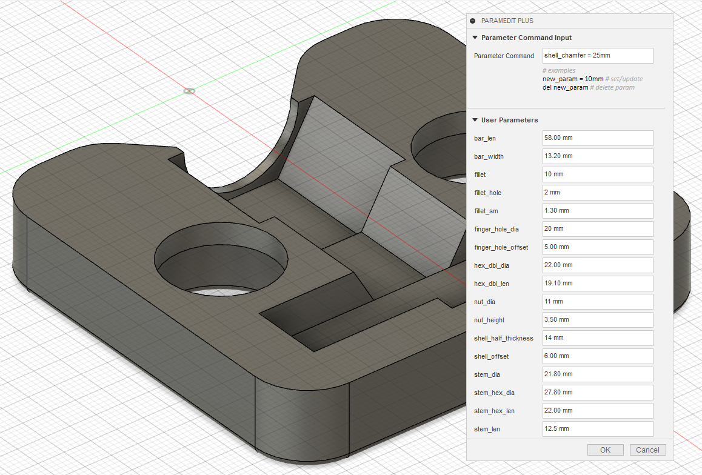

#  ParamEditPlus

This is an [Autodesk Fusion 360](http://fusion360.autodesk.com/) script allows you to quickly manage  user parameters using only the keyboard.

95% of the credit goes to [Patrick Rainsberry](https://twitter.com/prrainsberry) for [ParamEdit](https://github.com/tapnair/ParamEdit), which I simply copied and added some features that I wanted. Follow his [readme](https://github.com/tapnair/ParamEdit#readme) for installation instructions.

*Highly* recommend also installing the [AnyShortcut](https://github.com/thomasa88/AnyShortcut) add-in, as these two play very nicely together.

## Usage

* Once activated, open via the Solid > Modify > ParamEditPlus menu.
* Use tab and shift+tab to navigate through parameters.
* Existing parameters will update in preview as you change them.
* Pressing ESC will cancel whatever changes you've made.
* The Paramater Command Input allows you to create, modify, and delete parameters using only the keyboard.
* I swear, it's like nobody who built the default Change Parameters dialog has ever used hotkeys before.
* You can't delete parameters that are referenced by other parameters, but Fusion thinks you can. [It's a bug.](https://help.autodesk.com/view/fusion360/ENU/?guid=GUID-5f76a1ac-68fd-45da-bc7d-9bec963d775d)

## Written by

Originally written by [Patrick Rainsberry](https://twitter.com/prrainsberry)
Extended by yours truly.

